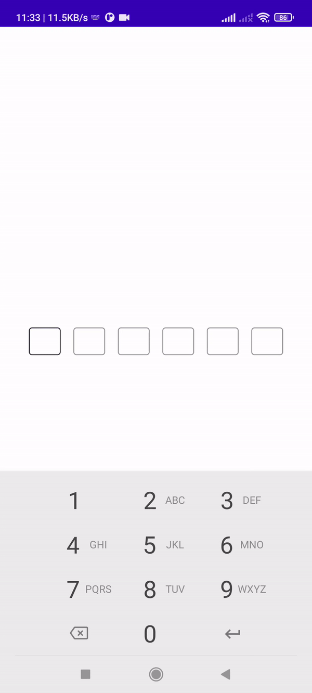

<h1 align="center">Jetpack Compose Otp Text Field</h1>




## How to integrate into your app?

Step 1. Add the JitPack repository to your settings.gradle

```java
dependencyResolutionManagement {
    repositoriesMode.set(RepositoriesMode.FAIL_ON_PROJECT_REPOS)
    repositories {
        google()
        mavenCentral()
        
        //add this line
        maven { url 'https://jitpack.io' }
    }
}
```

Step 2. Add the dependency to your build.gradle
```java
dependencies {
	implementation 'com.github.NaufalRachmandani:OtpTextField:1.0'
}
```

## How to use the library?
Okay seems like you integrated the library in your project but **how do you use it**? Well its really easy.
- Using Compose
Just use the `OtpTextField` composable where you need to display the view like.
```kotlin
....
OtpTextField(
	otpText = otp,
	onOtpTextChange = onOtpChange,
	isError = false,
	textStyle = TextStyle(
	    fontWeight = FontWeight.SemiBold,
	    fontSize = 14.sp
	),
	focusedBorderColor = neutral100,
	unFocusedBorderColor = neutral60,
	backgroundColor = Color(0xFFFFFFFF),
	focusedTextColor = neutral60,
	unFocusedTextColor = neutral100,
	focusedBorderErrorColor = primaryRed,
	unFocusedBorderErrorColor = primaryRedHover,
	backgroundErrorColor = primaryRedFocus,
	focusedTextErrorColor = neutral60,
	unFocusedTextErrorColor = neutral100,
)
....
```

## Author
Created by [Naufal Rachmandani](https://github.com/NaufalRachmandani)

* Bug reports and pull requests are welcome.
